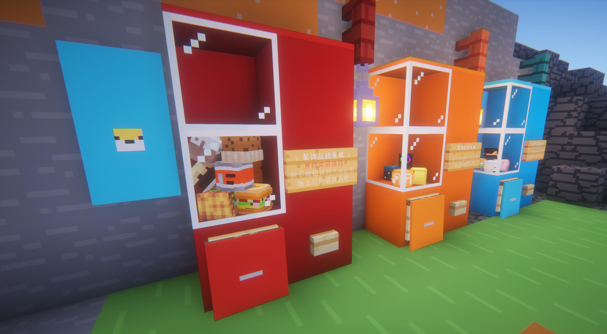

# Lumos Engine

## 插件介绍
LumosEngine是基于HoverLib重构的Spigot-1.20插件。相较于HoverLib，LumosEngine在架构上形成了高度解耦的模块化架构以及更强大的功能。LumosEngine不再像HoverLib一样将方法闭塞在事件中，而是被单独分离了出来作为API来作为二方库或三方库进行调用。

LumosEngine为服务器提供了更方便的操作物品展示实体、方块展示实体的方法；一套可自定义的盔甲纹饰增益效果；内建的Web接口应用以及更多可选择性启用的事件功能。

## 插件功能
### 操作展示实体
插件所涵盖的展示实体分为物品展示实体与方块展示实体，命令分别如下（特殊的：除了在基本指南中不会出现特殊的符号，其它指南中的中括号表示可选输入、尖括号为参数内容）：

| 指令            | 权限                | 功能   |
|---------------|-------------------|------|
| /display      | hover.display.use | 基本指南 |
| /display help | hover.display.use | 基本指南 |

#### 物品展示实体

物品展示实体时1.19.4新增的实体，同类型的展示实体一共有4个，其中text_display文本展示实体已经在CMI中得到了应用，还有一个未开发的是交互性实体。
物品展示实体允许用户创建一个没有碰撞箱的展示物品，这些实体不会占用很多的服务器性能（但也不是绝对的）。
非管理员玩家在创建时会根据配置来消耗手持物品，在回收时这些展示实体也会掉落返回给玩家。

| 指令                                                                                                     | 权限                         | 功能                                                           |
|--------------------------------------------------------------------------------------------------------|----------------------------|--------------------------------------------------------------|
| /display item \[help\]                                                                                 |                            | 创建物品展示实体指南                                                   |
| /display item \<x\> \<y\> \<z\> \<rx\> \<ry\> \<rz\> \<sx\> \<sy\> \<sz\> \[\<type\>\] \[\<boolean\>\] | hover.display.item.place   | 在坐标\<x y z\>处为手持的物品创建一个缩放为\<scale\>三轴旋转角为\<rx ry rz\>的物品展示实体 |
| /display item recycle                                                                                  | hover.display.item.recycle | 回收配置中指定的半径范围内的物品展示实体                                         |


参数解释：
1. \<x\> \<y\> \<z\> 这三个变量表示了一个三维坐标（可以带小数或负号），你可以使用`~`符号来表示绝对定位，也可以使用`~-2`的形式来表示对绝对定位的偏移（偏移量只能是整数）
2. \<rx\> \<ry\> \<rz\> 这三个变量表示了该实体在三轴方向上的旋转角度（即：rotate x，rotate y，rotate z）这些变量的值必须是\(-∞,+∞\)的任意一个整数
3. \<sx\> \<sy\> \<sz\> 物品实体在xyz轴上的缩放比例，该值必须是一个配置区间内的任意一个小数
4. \[\<type\>\] 是物品展示实体的模式（见：[Minecraft Wiki](https://minecraft.fandom.com/zh/wiki/%E5%B1%95%E7%A4%BA%E5%AE%9E%E4%BD%93)）用于再次变换物品模型，固定的选项为`none`（不变换）、`thirdperson_lefthand`（第三人称视角左手变换）、`thirdperson_righthand`（第三人称视角右手变换）、`firstperson_lefthand`（第一人称视角左手变换）、`firstperson_righthand`（第一人称视角右手变换）、`head`（放置在头部物品栏的变换）、`gui`（在图形界面中的变换）、`ground`（平铺在地面的变换）和`fixed`（默认变换）。默认为`fixed`。
5. \[\<boolean\>\] 这个布尔值代表是否允许其他人也回收你所放置的这个物品展示实体，默认为`false`

这里展示一个扭蛋机成品以及一部分指令（你首先得拥有一个头颅库插件）：

```text
/display item 395.3 79.15 -273.7 0 45 0 0.6 0.6 0.6
/display item 395.7 79.15 -273.7 0 60 0 0.6 0.6 0.6
/display item 395.5 79.15 -273.25 0 30 0 0.6 0.6 0.6
/display item 395.35 79.48 -273.4 0 30 0 0.6 0.6 0.6
/display item 395.75 79.48 -273.4 0 -30 -45 0.6 0.6 0.6
/display item 395.5 79.48 -273.7 0 -45 0 0.6 0.6 0.6
/display item 395.4 79.81 -273.755 0 -45 0 0.6 0.6 0.6
/display item 395.45 79.81 -273.32 0 -18 0 0.6 0.6 0.6
/display item 395.73 79.81 -273.55 0 -30 30 0.6 0.6 0.6
```



#### 方块展示实体
了解过物品展示实体后方块展示实体其实也就是那么回事，方块实体的创建比物品实体会简单一些，因为它不具备物品的“展示实体模式”属性。
非管理员玩家在创建时会根据配置来消耗手持物品，在回收时这些展示实体也会掉落返回给玩家。

| 指令                                                                                         | 权限                          | 功能                                                           |
|--------------------------------------------------------------------------------------------|-----------------------------|--------------------------------------------------------------|
| /display block \[help\]                                                                    |                             | 创建方块展示实体指南                                                   |
| /display block \<x\> \<y\> \<z\> \<rx\> \<ry\> \<rz\> \<sx\> \<sy\> \<sz\> \[\<boolean\>\] | hover.display.block.place   | 在坐标\<x y z\>处为手持的物品创建一个缩放为\<scale\>三轴旋转角为\<rx ry rz\>的方块展示实体 |
| /display block recycle                                                                     | hover.display.block.recycle | 回收配置中指定的半径范围内的方块展示实体                                         |

参数解释：
1. \<x\> \<y\> \<z\> 这三个变量表示了一个三维坐标（可以带小数或负号），你可以使用`~`符号来表示绝对定位，也可以使用`~-2`的形式来表示对绝对定位的偏移（偏移量能是整数）
2. \<rx\> \<ry\> \<rz\> 这三个变量表示了该实体在三轴方向上的旋转角度（即：rotate x，rotate y，rotate z）这些变量的值必须是\(-∞,+∞\)的任意一个整数
3. \<sx\> \<sy\> \<sz\> 方块实体在xyz轴上的缩放比例，该值必须是一个配置区间内的任意一个小数
4. \[\<boolean\>\] 这个布尔值代表是否允许其他人也回收你所放置的这个方块展示实体，默认为`false`

这里展示一棵奇怪的树（如果您有更好的展示图片欢迎您投稿）：


### 自定义的盔甲纹饰效果
插件支持自定义盔甲纹饰的增益效果，它包括可以为穿戴者提供药水BUFF增强、将BUFF作用于攻击者、以及一些内置的事件系统。这些都可以在`trim_upgeade.yml`配置文件中进行配置。

- 在配置中`trim-material`节点表示了支持的盔甲纹饰材质，可以是“铜质(copper)、紫水晶质(amethyst)、下届石英质(quartz)、青金石质(lapis)、红石质(redstone)、金质(gold)、绿宝石质(emerald)、铁质(iron)、钻石质(diamond)、下界合金质(netherite)”中的任意一种，你也可以使用`trim-material: "*"`来指定支持所有材质。
- 在配置中`armor-material`节点表示了支持的盔甲类型，可以是“皮革(leather)、锁链(chainmail)、铁(iron)、金(golden)、钻石(diamond)、下界合金(netherite)”中的任意一种，你也可以使用`armor-material: "*"`来指定支持所有材质。
- 在配置中`buff`节点表示了这种盔甲纹饰和盔甲材质下的增益效果是什么，它支持数组的形式进行配置，每个数组中包含以下节点信息
  - `count`表示至少需要穿几件才能有这个配置的效果（原神里的圣遗物几件套效果）
  - `event`（可选）表示盔甲会触发的事件，可选的有“respawn_here(死亡后原地复活)、exploit_villagers(与村民交易会掉落铁粒和金粒)、neutral_piglin(非主动攻击不会引起猪灵仇恨)、docile_enderman(允许直视末影人)”
  - `effect`（可选）药水效果，请自行参考站内的药水效果列表
  - `effect-level`表示药水的等级，从1开始表示I级
  - `effect-target`表示药水作用的对象，可选的有“self(自身)、attacker（攻击者）”，当设置为`attacker`时需要和`event-chance`搭配使用
  - `event-chance`事件发生的概率，必须是一个0-1区间的小数（不要写成1要写成1.0）

在插件中提供了一套默认的配置，如果有需要可以自行修改它们。

### 轻量级白名单
插件也同样提供了轻量级白名单的功能，你可以在`whitelist.yml`文件中进行配置，基本的指令如下：

| 指令                                          | 权限     | 功能       |
|---------------------------------------------|--------|----------|
| /lumos whitelist                            |        | 白名单使用指南  |
| /lumos whitelist enable                     | 默认管理员  | 启用白名单    |
| /lumos whitelist disable                    | 默认管理员  | 禁用白名单    |
| /lumos whitelist add \[\<player_name\>\]    | 默认管理员  | 为玩家添加白名单 |
| /lumos whitelist remove \[\<player_name\>\] | 默认管理员  | 为玩家移除白名单 |

你也可以手动在whitelist文件的users节点中批量添加，然后重载插件。

### 轻量级小功能
插件还综合了一些比较实用的小功能，他们在配置中是默认开启的，你可以手动关闭他们：

```yaml
feature:
  # 是否防止苦力怕爆炸、恶魂火球爆炸破坏地形
  protect-terrain: true
  # 是否阻止末影人拿起方块
  prevented-enderman: true
  # 是否启用工作台破坏后只掉落1-3个木板
  crafting-table: true
  # 是否下调铁傀儡的掉落物为0-3个铁粒+1朵虞美人
  iron-golem: true
  # 是否禁用铁傀儡的自然生成，玩家造的不算
  summon-iron-golem: true
  # 是否启用更蠢的村民，启用后村民不会繁殖、不会刷新职业、不会补货、不会穿过地狱门
  stupid-villager: true
  # 是否启用白名单
  enable-whitelist: true
  # 玩家在直的激活的动力铁轨上是否加速行驶
  minecart:
    # 是否启用这个功能
    enable: true
    # 提升的速度倍数
    multiple: 2.0
```

### 内建Web接口
这是一个实验性的功能，并且只支持MySQL，如果你不喜欢他请在`application.yml`文件中关闭它。如果你想使用它请按照如下步骤建立你的MySQL数据库：

1. 创建一个数据库，使用utf8mb4字符集
2. 将源码仓库中的`/sql/player_store.sql`执行到你的数据库创建出这个表
3. 在application.yml中修改数据库名以及你的数据连接信息

在玩家离线后他们的数据就会被存储到你的MySQL中，虽然这些数据表作为实验性功能可能随时都会更改结构但是大致上是不会影响你在下一个版本的接口使用。

你也可以在配置中修改Web应用的端口号，启动后可以使用你的公网+端口号访问下面的接口（如果你做了Nginx代理的话另当别论）：

1. `/api/player/<player_name>` 获取玩家的数据，可以是离线的也可以是在线的

## 开发者指南
本插件源码为开发者准备了一套简易的开发者指南[《开发者指南》](DEVELOPMENT.md)感兴趣的读者可以阅读并尝试自行开发本插件。
